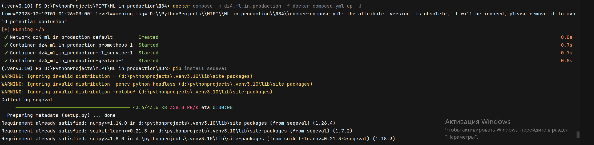
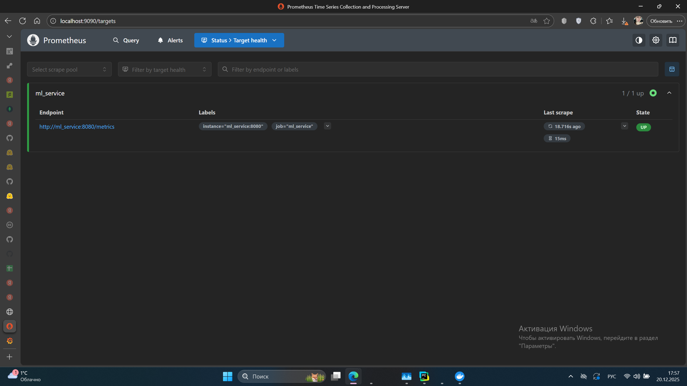
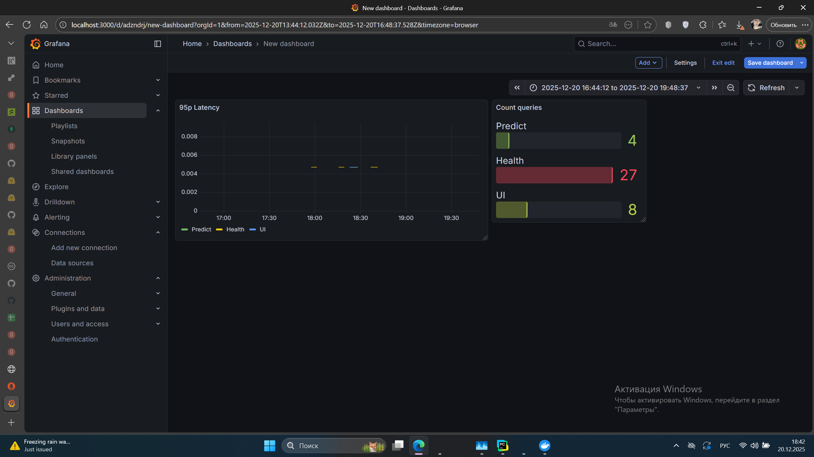
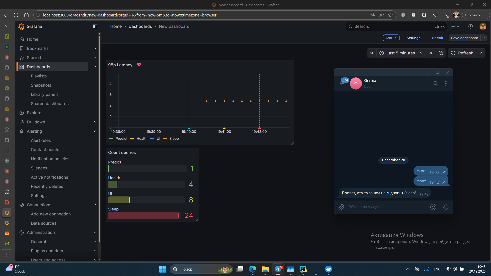

# MLOps HW4 — ml_grafna_slo_MazurinaEA

## 📌 Краткое описание проекта
Проект реализует REST‑сервис для предсказаний на основе обученной ML‑модели (Wine dataset). Сервис предоставляет методы:

  * /health — проверка состояния сервера, доступности модели и версии.
  * /ui — HTML‑форма для ввода 13 признаков вина и получения предсказания.
  * /predict — обработка данных формы и возврат предсказанного класса вина в формате JSON.
  * /metrics — экспорт метрик Prometheus (latency, количество запросов и др.).
  * /sleep — тестовый эндпоинт для искусственного увеличения задержки (используется для проверки алертов).

🔧 Логирование
Реализовано логирование всех эндпоинтов через стандартный модуль logging. В терминале отображаются входящие запросы.

📊 Метрики
В проект интегрирован prometheus_client, который собирает ключевые метрики сервиса:

  * Счётчик запросов — requests_total = Counter("requests_total", "Total number of requests", ["endpoint"]). Позволяет отслеживать количество вызовов каждого эндпоинта.
  * Гистограмма задержек (latency) — request_latency_seconds = Histogram("request_latency_seconds", "Request latency", ["endpoint"]). Используется для построения p95 latency в Grafana и настройки SLO/алертов.

Метрики доступны по адресу /metrics и автоматически собираются Prometheus.

**SLO (Service Level Objective)** — это конкретная, измеримая цель по качеству работы сервиса, которую вы устанавливаете для себя или для пользователей.

В проекте реализован SLO: p95 latency ≤ 1 сек → 95% запросов должны обрабатываться быстрее 1 секунды.

Обоснование выбора: критично для UX, стабильности и SLA.

Алертинг задержки реализовать через тг-бот.

## 📂 Структура проекта

 ml_grafna_slo_MazurinaEA/ # Репозиторий

 ├── app/
 
 │    └── main.py # Сервис

 ├── images/ # Картинки с работой сервиса

 ├── models/
 
 │    └── model.pkl # Обученная модель

 ├── .dockerignore # файл описания, что игнорировать

 ├── Dockerfile # Описание контейнера для сборки и запуска ML Service

 ├── README.md # Документация
 
 ├── docker-compose.yml # Конфигурации для запуска ML Service, Prometheus, Grafna
 
 ├── prometheus.yml # Конфигурация Prometheus для мониторинга метрик из ML Service
 
 ├── requirements.txt # Зависимости
 
 └── ДЗ4.ipynb # Ноутбук с выполнением

## 🎯 Цель проекта
Задание выполняется в рамках модуля «Мониторинг и наблюдаемость в продакшене».
Освоить базовые приемы настройки мониторинга и алертинга для ML-сервиса:

  * создать систему наблюдаемости с Prometheus и Grafana;
  * определить SLO (Service Level Objective) для сервиса;
  * настроить автоматический алерт при его нарушении.

После выполнения студент:

  * собирает и визуализирует метрики из python-сервиса;
  * определяет ключевые показатели доступности и производительности (Latency, Error Rate);
  * создает правила алертинга в Grafana;
  * проверяет срабатывание алерта при выходе метрик за допустимые границы.

## 🚀 Как запустить (3–6 команд)
Для запуска проекто необходимо сделать следующие действия командами:

  - клонировать репозиторий: git clone https://github.com/ElizavetaMaz/ml_grafna_slo_MazurinaEA
  - перейти в репозиторий: cd ml_grafna_slo_MazurinaEA
  - собрать Docker‑образ: docker build -t ml-service-dz4-ml-in-prodaction:v1 . 
  - Запустить контейнеры: docker compose -p dz4_ml_in_prodaction -f docker-compose.yml up -d

Далее сервисы доступны:

  - http://127.0.0.1:8000/ - ML Service
  - http://localhost:9090/ - Prometheus
  - http://localhost:3000/ - Grafna

## 📷 Фото работы

